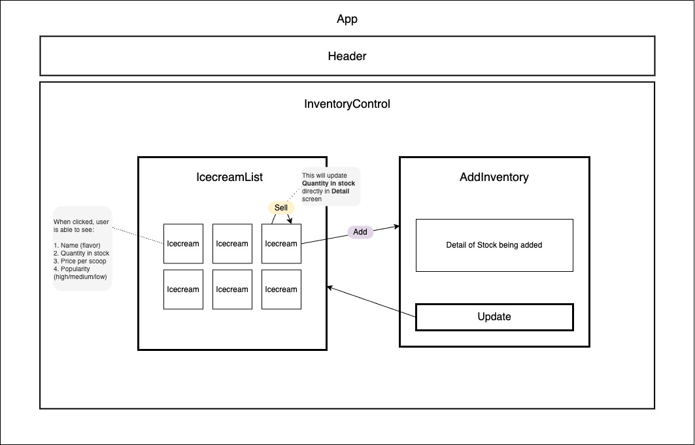
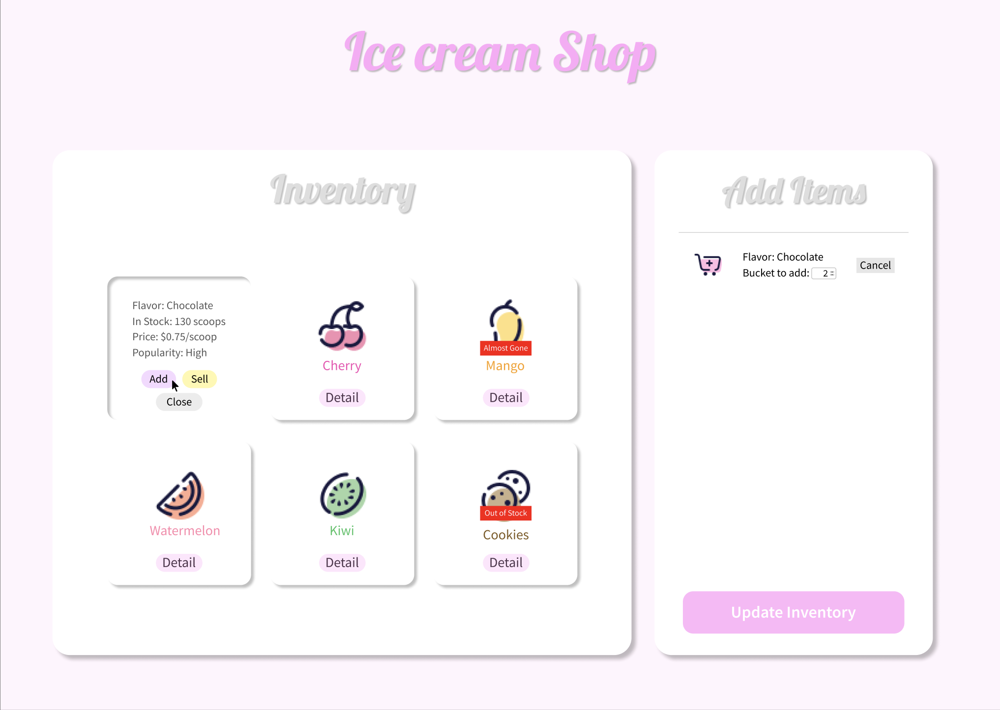

# Icecream Inventory Tracker 🍦

By [Hayeong Pyeon](https://www.hayeong.website)

## Table of Contents
1. [Technologies Used](#technologies-used)
2. [Description](#description)
3. [Planning Application](#planning-application)
4. [Setup Requirements](#setup-requirements)
5. [Github Pages](#github-pages)
6. [Known Bugs](#known-bugs)
7. [License](#license)

## Technologies used
- HTML, SCSS, JavaScript
- Webpack, Node.js
- React (JSX, PropTypes)

## Description
- This is an independent project provided from Epicodus.
- This project is to review **React Fundamentals** course.

## Planning Application 
### Diagram 

### Wireframing 

## Setup Requirements
1. Clone this repository to your desktop and open it with a text editor.
2. Install all packages with `npm install`.
3. Start a development server with `npm run start`.

## Github Pages
https://hypyeon.github.io/epicodus-project8-inventory-tracker/

## Known Bugs
- No known bug found as of Jan 27, 2024

## License
[MIT](/LICENSE.txt) Copyright © 2024 Hayeong Pyeon